# ThirdHand
<p align="center">
    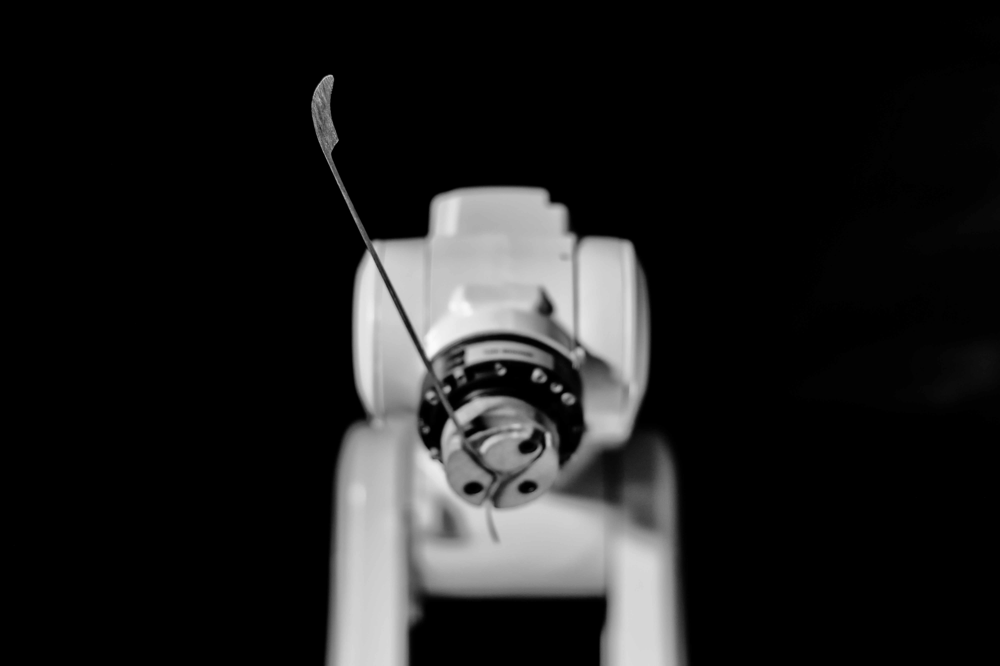
</p>

ThirdHand is a case study as part of my  PhD research on "*A Situated Collaborative Framework for Machine Learning-Based Toolmaking for Creative Practitioners*".  


## Summary
I collaborated with a mucsician to create a robtic musical instrument based on the user-generated data. A generative model was trained on the collected data from the musician to control a robotic arm to play Santoor, a traditional Persian musical instrument. <br>
<br>

<p align="center">
    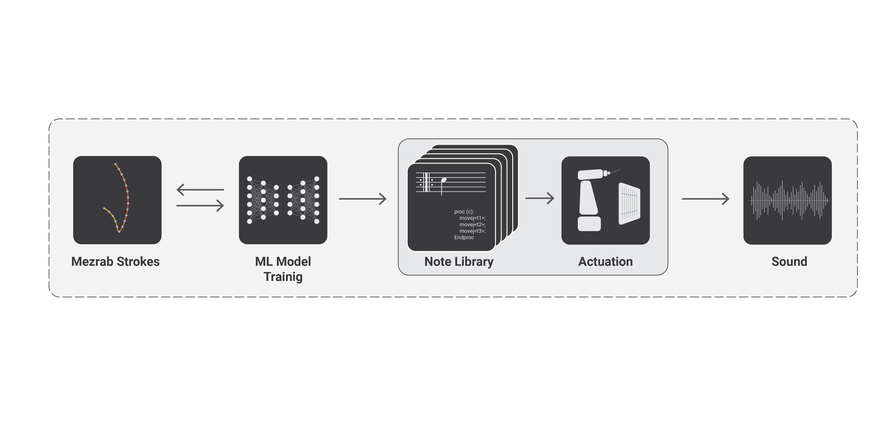
</p>


## Data Pipeline
<p align="center">
    
    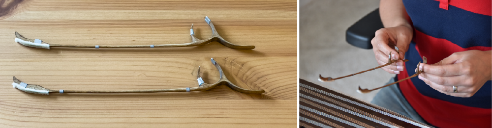
</p>


## Data Post Processing
<p align="center">
    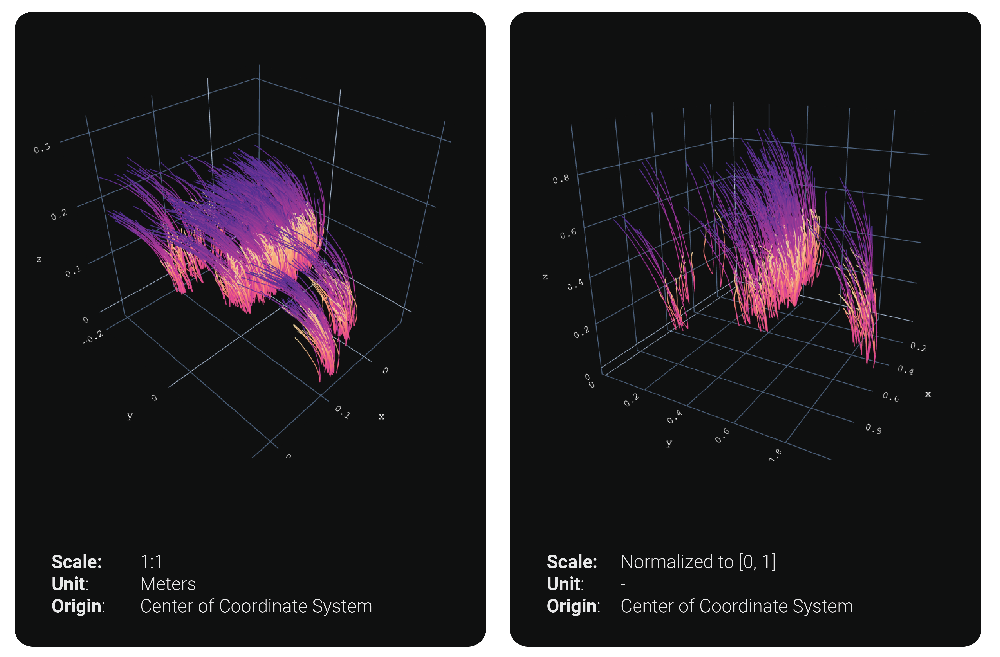
    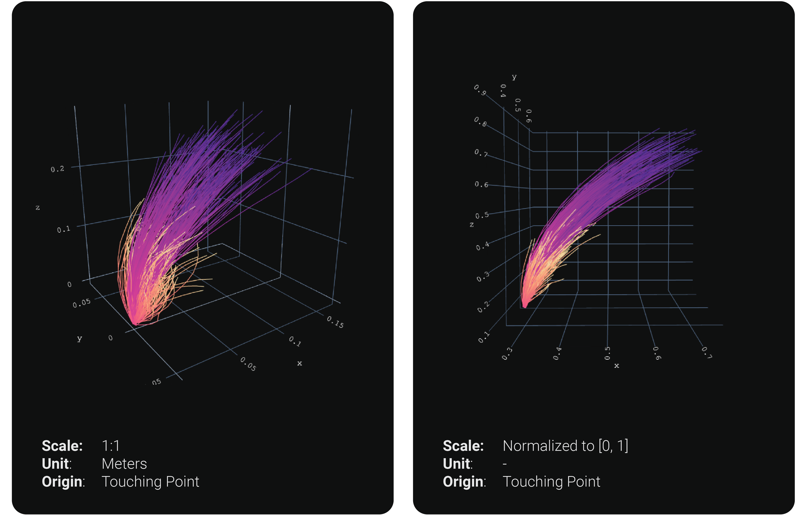
</p>

<p align="center">
    
</p>

## ML Models


<p align="center">
   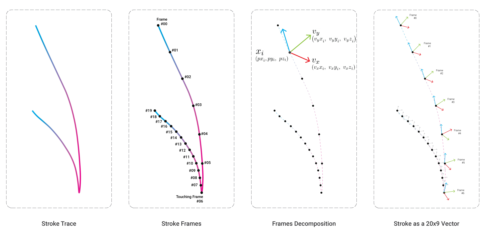
</p>
<p align="center">
   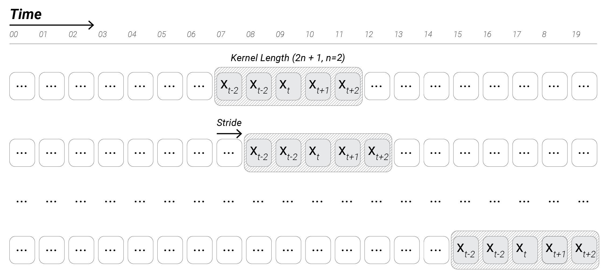
</p>
<p align="center">
   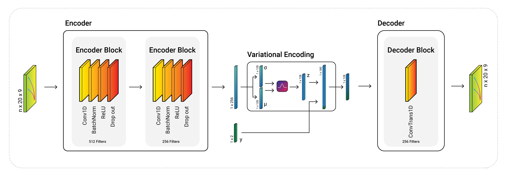
</p>


## Model's Performance
### Reconstruction
<p align="center">
   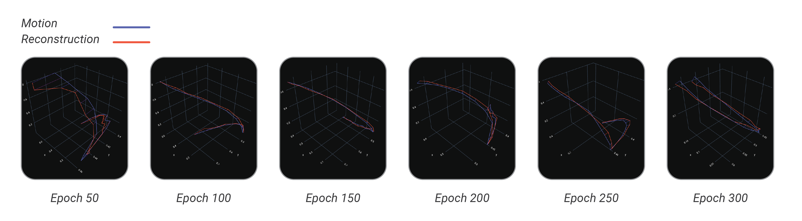
</p>
### Generation
<p align="center">
   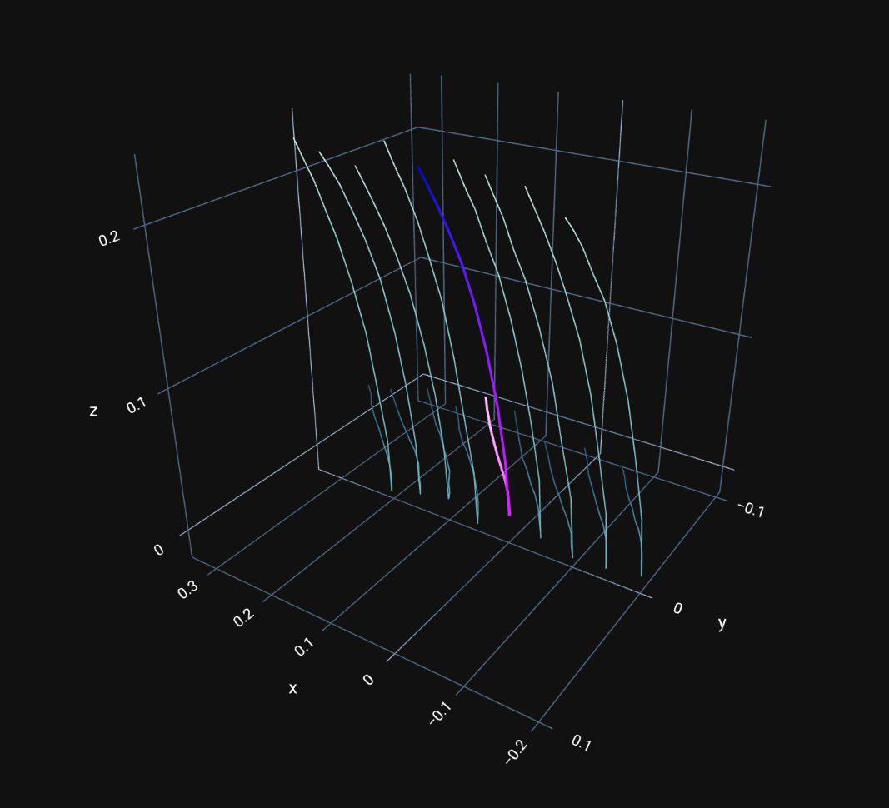
</p>

## Robotic Setup
<p align="center">
   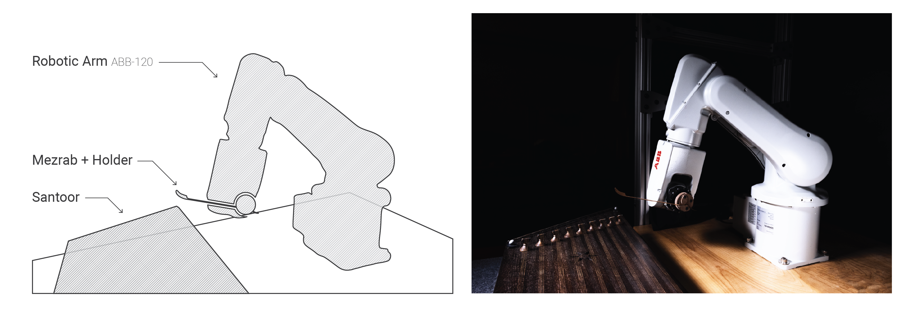
   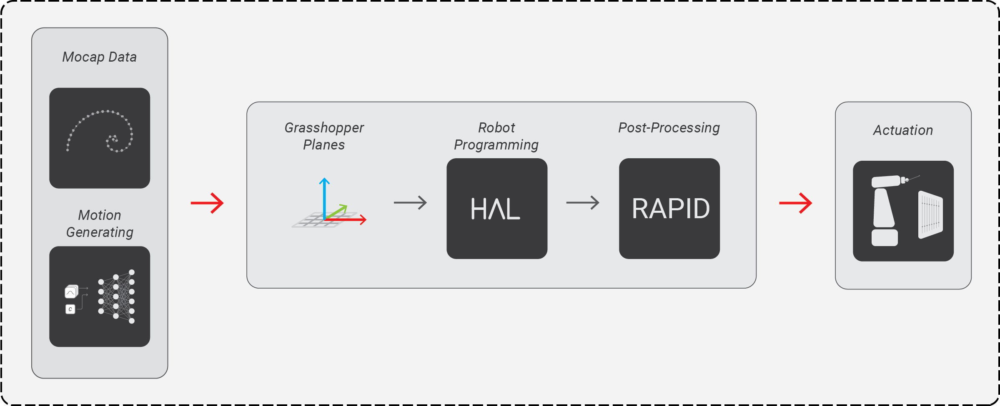
</p>
<div align="center">
    <p float="left">
            
             
    </p>
</div>

## Demo
https://user-images.githubusercontent.com/21223496/210703346-255a4f03-ba97-4ae0-a68b-d9ed55cedbb7.mp4
<p align="center">
   
</p>

## Requirements:
### Base:
* Python: 3.10.8
* CUDA: 11.6

### Dependencies:
Use the [spec-file.txt](spec-file.txt) to reproduce the Conda environment. The main libraries are listed below:
* [PyTorch](https://pytorch.org/get-started/locally/) 1.13.1 <br>
    ``` conda install pytorch torchvision torchaudio pytorch-cuda=11.6 -c pytorch -c nvidia```
* [Tensorboard](https://www.tensorflow.org/tensorboard) 2.11.0 <br>
    ```conda install -c conda-forge tensorbaord```
* [WandB](https://wandb.ai/site) 0.13.7 <br>
    ```conda install wandb --channel conda-forge```
* [Plotly](https://plotly.com/) 5.11.0 <br>
    ```conda install -c plotly plotly```
* [Scikit-Learn](https://scikit-learn.org/) 1.1.2 <br>
    ```conda install -c conda-forge scikit-learn```
* [Pandas](https://pandas.pydata.org/) 1.5.2 <br>
    ```conda install pandas```
* [OpenTSNE](https://opentsne.readthedocs.io/en/latest/index.html) 0.6.2 <br>
    ```conda install --channel conda-forge opentsne```
* [PeakUtil](https://peakutils.readthedocs.io/en/latest/#installation) 1.3.3
    * Download the files from this [link](https://zenodo.org/record/887917#.Y7RLnnbMIuU),
    * Unzip the package and navigate to the folder,
    * Run the srtup file:<br>
    ```python setup.py isntall```
* [Kaleido](https://pypi.org/project/kaleido/#description) <br>
    ```conda install -c conda-forge python-kaleido```
* [NBFormat](https://pypi.org/project/nbformat/) <br>
    ```conda install -c conda-forge nbformat```
