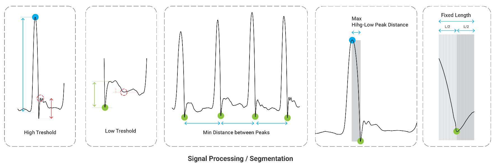
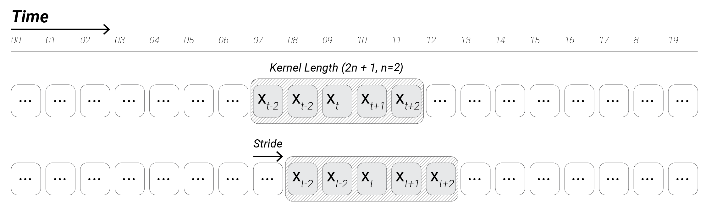
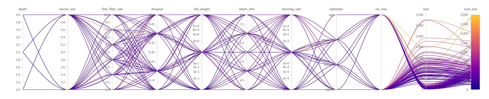

# ThirdHand
<p align="center">
    
</p>
Ardavan Bidgoli &copy;

ThirdHand is a case study as part of my  PhD research on "*A Collaborative Framework for Machine Learning-Based Toolmaking for Creative Practitices*". This study proposes a framework for making robotic musical instruments to augment an artist’s capability to play santur. It is not destined to replace the artist, but it is an effort to explore the affordances of machine learning for musical toolmaking. <br>
This project utilizes a dataset of six-degree-of-freedom motions provided by the musician as a vehicle to convey the specific idiom of the artist. The samples presented earlier in this chapter did not focus on this aspect.<br>


## Summary
This study focuses on developing a robotic musical instrument to play santur based on the samples provided by the participating musician. Accordingly, composing, generating, or improvising music is out of the scope of this study. The data modality is restricted to mezrab strokes, encoded as sequences of six-degree-of-freedom motions. <br>

<br>

A Conditional Variational AutoEncoder was trained on the mezrab motions demonstrated by the musician. We want to see if it is possible to generate  novel mezrab stroke samples that closely resembles hers, but with slight variation, and then play them on a robotics arm. The model does not generate or compose new musical scores and the robotic musical instrument does not behaves interactively.  

<p align="center">
    
</p>

## Data Pipeline
*Santur* is a traditional Persian stringed musical instrument with common roots with the hammered dulcimer. The instrument is usually played while putting stationary on an inclined platform. Its trapezoidal frame seats in front of the musician and provides a flat framework for its 72 strings.
The data samples are 6-DoF motiones of mezrabs (hammers). Each mezrab was tagged with reflective tapes to allow the motion capture system register their motion @120Hz.  
<p align="center">
    
    
</p>
The stream of motion capture data was later cleaned saved as csv fiels. The functions available in *thirdHand_data_loader.py* automatically sliced the data into shorter sequences and assing the left/right hand labels. The samples are scaled into [0, 1] and centered around the (0,0,0).
<br>
<br>
<p align="center">
    
</p>

<p align="center">
    
    
</p>

Each motion each sample was formatted as a 20 × 9 vector, representing the 20 poses in space, each defined by a point and two vectors. 

$$\ X_t = [x_0, x_1, ..., x_19]$$

$$
\ x_i = [px_i, py_i, pz_i, v_xx_i, v_xy_i, v_xz_i, v_yx_i, v_yy_i, v_yz_i, ]$$

<p align="center">
   
</p>
## ML Models
The model is based on the general Conditional Variational AutoEncoder architecture. he conditioning signal is a one-hot vector of dim 1x2 that determines the hand label.
<p align="center">
   
</p>
The temporal features of the mezrab's motions werer captured using 1-D CNN layers. T
<p align="center">
   
</p>
The model was optimized using WandB optimizer.
<p align="center">
   
</p>
## Model's Performance
The model can reconstruct the motions after around 150 epochs and it can be used to generate new motions by sampling from the latent space.
<p align="center">
   
</p>
<p align="center">
   
</p>

## Robotic Setup
The generated motions were post-processed using *Grasshopper* and *HAL* plugin to control a robotic arm, equipped with a mezrab. 
<p align="center">
   
</p>
<div align="center">
    <p float="left">
            
             
             
    </p>
</div>
<p align="center">
   
</p>

## Demo
On the left side video, the robot plays notes based on the motion generated by the C-VAE model, on the right side, the robot just repeats a single-joint motion to strike the strings.
<div align="center">
    <p float="left">
            
    </p>
</div>

# Code Details
To train the model, use [thirdhand_trainer.py](./thirdhand_trainer.py). The default hyper-parameters are extracted from the  on the WandB optimization results. 
```python thirdhand_trainer.py```
To optimize the model using WandB, use the [optimizer boiler plate notebook](./Optimization_boilerplate.ipynb).     

## Requirements:
* Python: 3.10.8
* CUDA: 11.6

## Dependencies:
Use the [spec-file.txt](spec-file.txt) to reproduce the Conda environment. The main libraries are listed below:
* [PyTorch](https://pytorch.org/get-started/locally/) 1.13.1 <br>
    ``` conda install pytorch torchvision torchaudio pytorch-cuda=11.6 -c pytorch -c nvidia```
* [Tensorboard](https://www.tensorflow.org/tensorboard) 2.11.0 <br>
    ```conda install -c conda-forge tensorbaord```
* [WandB](https://wandb.ai/site) 0.13.7 <br>
    ```conda install wandb --channel conda-forge```
* [Plotly](https://plotly.com/) 5.11.0 <br>
    ```conda install -c plotly plotly```
* [Scikit-Learn](https://scikit-learn.org/) 1.1.2 <br>
    ```conda install -c conda-forge scikit-learn```
* [Pandas](https://pandas.pydata.org/) 1.5.2 <br>
    ```conda install pandas```
* [OpenTSNE](https://opentsne.readthedocs.io/en/latest/index.html) 0.6.2 <br>
    ```conda install --channel conda-forge opentsne```
* [PeakUtil](https://peakutils.readthedocs.io/en/latest/#installation) 1.3.3
    * Download the files from this [link](https://zenodo.org/record/887917#.Y7RLnnbMIuU),
    * Unzip the package and navigate to the folder,
    * Run the srtup file:<br>
    ```python setup.py isntall```
* [Kaleido](https://pypi.org/project/kaleido/#description) <br>
    ```conda install -c conda-forge python-kaleido```
* [NBFormat](https://pypi.org/project/nbformat/) <br>
    ```conda install -c conda-forge nbformat```

---
By Ardavan Bidgoli, 2021-2022, [GitHub](https://github.com/Ardibid)
Developed as a part of Ardavan Bidgoli's PhD thesis @ Carnegie Mellon University, school of Architecture. In collaboration with Mahtab Nadalian. <br>
This project was partially supported by CMU School of Architecture Micro Grant. <br>
If you are interested in robotic musical instrument design for Persian music, you will enjoy [Santoor Bot by Mohammad Jafari](https://music.gatech.edu/santoor-bot), as much as I did! The primary difference between the two projects is the focus on the musician specific mezrab motions and using a deep learning model to generate new motions simialr to the one demonstrated by the musician. <br>